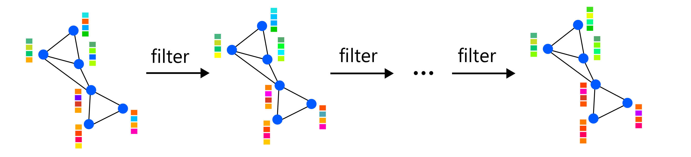
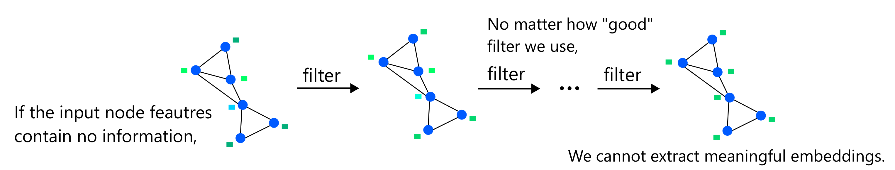
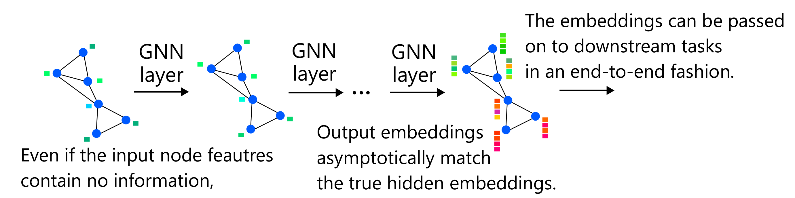
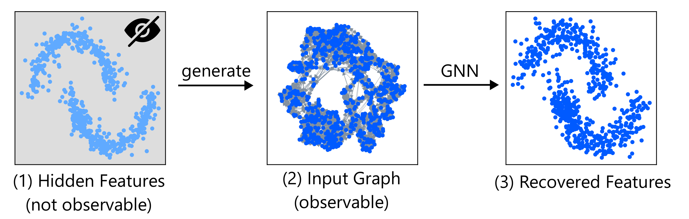
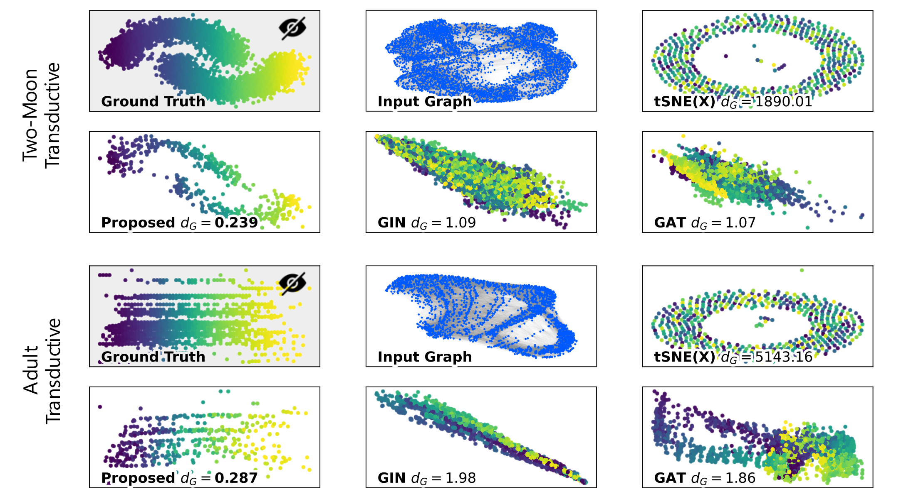
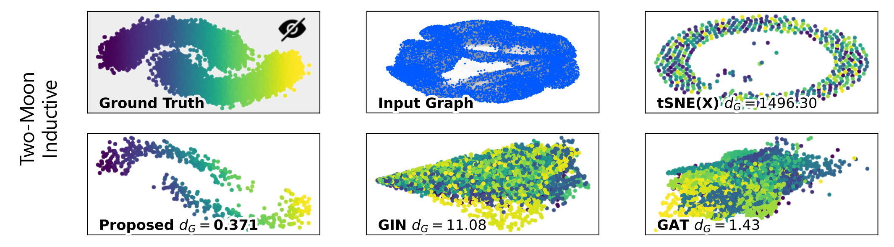

# Graph Neural Networks can Recover the Hidden Features Solely from the Graph Structure (ICML 2023)

[](https://arxiv.org/abs/2301.10956)

We proved that GNNs can create completely new and useful node features even when the input node fatures are uninformative, by absorbing information from the graph structure.

Paper: https://arxiv.org/abs/2301.10956

## ✨ Summary



▲ **Traditional View of GNNs**: GNNs filter features by mixing them with neighboring nodes.



▲ **Traditional View of GNNs**: If the features are garbage, the outputs are also garbage.



▲ **Our Results**: We showed that GNNs create informative node features by themselves even when the input features are uninformative by absorbing information from the underlying graph. Therefore, GNNs work even when the input node features are uninformative.



▲ **Problem Setting**: We generate the input graph from hidden node features. We show that GNNs can recover them solely from the vanilla graph structure.

## 💿 Dependency

Please install dependencies by `pip install -r requirements.txt`.

[PyTorch](https://pytorch.org/) may not be installed due to GPU issues. Then please install it from the [official website](https://pytorch.org/) (e.g., by cpuonly flag).

## 📂 Files

* `shortest_path_plot.py` reproduces Figure 2.
* `semi_moon.py` reproduces the upper panel of Figure 3.
* `semi_adult.py` reproduces the lower panel of Figure 3.
* `ind_moon.py` reproduces Figure 4.
* `accuracy_of_recovered_features.py` reproduces Table 1.

## 🗃️ Download Dataset

Please run the following command in the root directory before the execution of `semi_adult.py`.

```
$ wget https://archive.ics.uci.edu/ml/machine-learning-databases/adult/adult.data
```

## 🧪 Evaluation

Reproduce the results by the following commands.

```
$ python shortest_path_plot.py
$ python semi_moon.py
$ python semi_adult.py
$ python ind_moon.py
$ python accuracy_of_recovered_features.py
```

The results are saved in `imgs` directiory.

### Results



▲ GNNs succeed in recovering the hidden features.



▲ GNNs succeed in recovering the hidden features even in the inductive setting.

| | Cora | CiteSeer | PubMed | Coauthor CS | Coauthor Physics | Amazon Computers | Amazon Photo |
| ---- | ---: | ---: | ---: | ---: | ---: | ---: | ---: |
| Baseline $\boldsymbol{x}^{\text{syn}}_v$ | 0.122 | 0.231 | 0.355 | 0.066 | 0.307 | 0.185 | 0.207 |
| Recovered Feature $\hat{\boldsymbol{z}}_v$ | **0.671** | **0.640** | **0.653** | **0.492** | **0.745** | **0.528** | **0.566** |

▲ These results show that the recovered features $\hat{\boldsymbol{z}}_v$ by GNNs are informative for downstream tasks while the input node features $\boldsymbol{x}^{\text{syn}}_v$ are not at all. This indicates that GNNs extract meaningful information solely from the graph structure. We stress that this problem setting where no node features are available is extremely challenging for GNNs, and the results above show that GNNs work well (somewhat unexpectedly) in such a challenging situation.

Please refer to the paper for more details.

## 🖋️ Citation

```
@inproceedings{sato2023graph,
  author    = {Ryoma Sato},
  title     = {Graph Neural Networks can Recover the Hidden Features Solely from the Graph Structure},
  booktitle = {International Conference on Machine Learning, {ICML}},
  year      = {2023},
}
```
